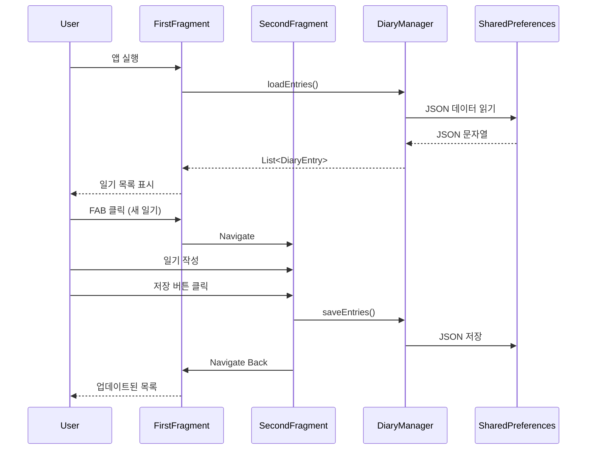

# Android 개발 1주차 강의노트
## 나만의 일기장 앱 만들기

**날짜:** 2025년 7월 20일  
**강의 목표:** Android 앱 개발 기초를 학습하고 다중 일기 관리가 가능한 일기장 앱 제작

---

## 📱 수업 개요

- Android 개발 기초 학습
- Fragment Navigation을 활용한 일기장 앱 제작
- 여러 개의 일기 목록 표시 (RecyclerView)
- 일기 작성/수정 및 기분 선택 기능
- JSON 형태로 데이터 저장

### 학습 목표
- Android 프로젝트 구조 이해
- Kotlin 기본 문법 학습 (data class, object, companion object)
- Fragment와 Navigation Component 활용
- RecyclerView와 Adapter 패턴 이해
- SharedPreferences + JSON을 활용한 데이터 저장
- Material Design 컴포넌트 활용

---

## 📂 1. Android 프로젝트 구조

실제 Week1MyDiary 프로젝트 구조:

```
Week1MyDiary/
├── app/
│   ├── src/main/
│   │   ├── java/com/example/week1mydiary/
│   │   │   ├── MainActivity.kt          ← 메인 액티비티
│   │   │   ├── FirstFragment.kt         ← 일기 목록 화면
│   │   │   ├── SecondFragment.kt        ← 일기 작성/수정 화면
│   │   │   ├── DiaryEntry.kt            ← 일기 데이터 클래스
│   │   │   ├── DiaryManager.kt          ← 데이터 관리 싱글톤
│   │   │   └── DiaryAdapter.kt          ← RecyclerView 어댑터
│   │   └── res/
│   │       ├── layout/
│   │       │   ├── activity_main.xml    ← 메인 레이아웃
│   │       │   ├── fragment_first.xml   ← 목록 레이아웃
│   │       │   ├── fragment_second.xml  ← 작성 레이아웃
│   │       │   └── item_diary_entry.xml ← 목록 아이템 레이아웃
│   │       └── navigation/
│   │           └── nav_graph.xml        ← 네비게이션 설정
│   └── build.gradle.kts
└── build.gradle.kts
```

### 주요 구성 요소
- **MainActivity**: Navigation Host를 담는 컨테이너
- **FirstFragment**: 일기 목록을 RecyclerView로 표시
- **SecondFragment**: 일기 작성/수정 화면
- **DiaryEntry**: 일기 데이터 모델 (data class)
- **DiaryManager**: SharedPreferences 관리 및 JSON 변환
- **DiaryAdapter**: RecyclerView용 어댑터

---

## 🎨 2. 데이터 모델 구현

### 2.1 DiaryEntry 데이터 클래스

```kotlin
package com.example.week1mydiary

import java.util.UUID

data class DiaryEntry(
    val id: String = UUID.randomUUID().toString(),
    val title: String,
    val content: String,
    val date: Long = System.currentTimeMillis(),
    val mood: String = "😊"
)
```

- **data class**: Kotlin의 데이터 클래스로 equals(), hashCode(), toString() 자동 생성
- **UUID**: 고유 ID 생성
- **기본값**: date는 현재 시간, mood는 기본 이모지

### 2.2 DiaryManager 싱글톤 객체

```kotlin
package com.example.week1mydiary

import android.content.Context
import android.content.SharedPreferences
import com.google.gson.Gson
import com.google.gson.reflect.TypeToken

object DiaryManager {
    private const val PREF_NAME = "diary_pref"
    private const val KEY_ENTRIES = "diary_entries"
    private lateinit var sharedPreferences: SharedPreferences
    private val gson = Gson()
    
    fun init(context: Context) {
        sharedPreferences = context.getSharedPreferences(PREF_NAME, Context.MODE_PRIVATE)
    }
    
    fun saveEntries(entries: List<DiaryEntry>) {
        val json = gson.toJson(entries)
        sharedPreferences.edit().putString(KEY_ENTRIES, json).apply()
    }
    
    fun loadEntries(): List<DiaryEntry> {
        val json = sharedPreferences.getString(KEY_ENTRIES, null) ?: return emptyList()
        val type = object : TypeToken<List<DiaryEntry>>() {}.type
        return gson.fromJson(json, type)
    }
}
```

- **object**: Kotlin의 싱글톤 패턴
- **Gson**: JSON 직렬화/역직렬화
- **TypeToken**: 제네릭 타입 정보 보존

---

## ⚡ 3. RecyclerView Adapter 구현

### 3.1 DiaryAdapter 클래스

```kotlin
package com.example.week1mydiary

import android.view.LayoutInflater
import android.view.ViewGroup
import androidx.recyclerview.widget.DiffUtil
import androidx.recyclerview.widget.ListAdapter
import androidx.recyclerview.widget.RecyclerView
import com.example.week1mydiary.databinding.ItemDiaryEntryBinding
import java.text.SimpleDateFormat
import java.util.*

class DiaryAdapter(
    private val onItemClick: (DiaryEntry) -> Unit
) : ListAdapter<DiaryEntry, DiaryAdapter.ViewHolder>(DiaryDiffCallback()) {
    
    override fun onCreateViewHolder(parent: ViewGroup, viewType: Int): ViewHolder {
        val binding = ItemDiaryEntryBinding.inflate(
            LayoutInflater.from(parent.context), parent, false
        )
        return ViewHolder(binding, onItemClick)
    }
    
    override fun onBindViewHolder(holder: ViewHolder, position: Int) {
        holder.bind(getItem(position))
    }
    
    class ViewHolder(
        private val binding: ItemDiaryEntryBinding,
        private val onItemClick: (DiaryEntry) -> Unit
    ) : RecyclerView.ViewHolder(binding.root) {
        
        private val dateFormat = SimpleDateFormat("yyyy년 MM월 dd일", Locale.KOREAN)
        
        fun bind(entry: DiaryEntry) {
            binding.textTitle.text = entry.title
            binding.textDate.text = dateFormat.format(Date(entry.date))
            binding.textMood.text = entry.mood
            binding.textContent.text = entry.content
            
            binding.root.setOnClickListener {
                onItemClick(entry)
            }
        }
    }
    
    class DiaryDiffCallback : DiffUtil.ItemCallback<DiaryEntry>() {
        override fun areItemsTheSame(oldItem: DiaryEntry, newItem: DiaryEntry) = 
            oldItem.id == newItem.id
        
        override fun areContentsTheSame(oldItem: DiaryEntry, newItem: DiaryEntry) = 
            oldItem == newItem
    }
}
```

- **ListAdapter**: 자동으로 리스트 변경사항 계산
- **DiffUtil**: 효율적인 리스트 업데이트
- **ViewHolder**: 뷰 재사용 패턴

---

## 💾 4. Fragment 구현

### 4.1 FirstFragment - 일기 목록 화면

```kotlin
class FirstFragment : Fragment() {
    private var _binding: FragmentFirstBinding? = null
    private val binding get() = _binding!!
    private lateinit var adapter: DiaryAdapter
    private var entries = mutableListOf<DiaryEntry>()
    
    override fun onCreateView(
        inflater: LayoutInflater, container: ViewGroup?,
        savedInstanceState: Bundle?
    ): View {
        _binding = FragmentFirstBinding.inflate(inflater, container, false)
        return binding.root
    }
    
    override fun onViewCreated(view: View, savedInstanceState: Bundle?) {
        super.onViewCreated(view, savedInstanceState)
        
        DiaryManager.init(requireContext())
        setupRecyclerView()
        loadEntries()
    }
    
    private fun setupRecyclerView() {
        adapter = DiaryAdapter { entry ->
            val action = FirstFragmentDirections
                .actionFirstFragmentToSecondFragment(entry.id)
            findNavController().navigate(action)
        }
        binding.recyclerView.adapter = adapter
    }
    
    private fun loadEntries() {
        entries = DiaryManager.loadEntries().toMutableList()
        adapter.submitList(entries.sortedByDescending { it.date })
    }
}
```

### 4.2 SecondFragment - 일기 작성/수정 화면

```kotlin
class SecondFragment : Fragment() {
    private var _binding: FragmentSecondBinding? = null
    private val binding get() = _binding!!
    private var selectedMood = "😊"
    private var editingEntry: DiaryEntry? = null
    
    override fun onViewCreated(view: View, savedInstanceState: Bundle?) {
        super.onViewCreated(view, savedInstanceState)
        
        setupMoodButtons()
        
        // 편집 모드 확인
        arguments?.getString("entryId")?.let { id ->
            editingEntry = DiaryManager.loadEntries().find { it.id == id }
            editingEntry?.let { loadEntry(it) }
        }
        
        binding.buttonSave.setOnClickListener { saveDiary() }
    }
    
    private fun saveDiary() {
        val title = binding.editTitle.text.toString()
        val content = binding.editContent.text.toString()
        
        if (title.isBlank() || content.isBlank()) {
            Toast.makeText(context, "제목과 내용을 입력해주세요", Toast.LENGTH_SHORT).show()
            return
        }
        
        val entries = DiaryManager.loadEntries().toMutableList()
        
        if (editingEntry != null) {
            // 수정
            val index = entries.indexOfFirst { it.id == editingEntry!!.id }
            if (index != -1) {
                entries[index] = editingEntry!!.copy(
                    title = title,
                    content = content,
                    mood = selectedMood
                )
            }
        } else {
            // 새로 생성
            entries.add(DiaryEntry(
                title = title,
                content = content,
                mood = selectedMood
            ))
        }
        
        DiaryManager.saveEntries(entries)
        findNavController().navigateUp()
    }
}
```

---

## 📋 5. 레이아웃 XML 파일

### 5.1 fragment_first.xml - 일기 목록 화면

```xml
<?xml version="1.0" encoding="utf-8"?>
<androidx.constraintlayout.widget.ConstraintLayout
    xmlns:android="http://schemas.android.com/apk/res/android"
    xmlns:app="http://schemas.android.com/apk/res-auto"
    android:layout_width="match_parent"
    android:layout_height="match_parent">
    
    <androidx.recyclerview.widget.RecyclerView
        android:id="@+id/recyclerView"
        android:layout_width="0dp"
        android:layout_height="0dp"
        app:layoutManager="androidx.recyclerview.widget.LinearLayoutManager"
        app:layout_constraintTop_toTopOf="parent"
        app:layout_constraintBottom_toBottomOf="parent"
        app:layout_constraintStart_toStartOf="parent"
        app:layout_constraintEnd_toEndOf="parent" />
        
</androidx.constraintlayout.widget.ConstraintLayout>
```

### 5.2 fragment_second.xml - 일기 작성 화면

```xml
<?xml version="1.0" encoding="utf-8"?>
<ScrollView xmlns:android="http://schemas.android.com/apk/res/android"
    android:layout_width="match_parent"
    android:layout_height="match_parent"
    android:padding="16dp">
    
    <LinearLayout
        android:layout_width="match_parent"
        android:layout_height="wrap_content"
        android:orientation="vertical">
        
        <TextView
            android:layout_width="wrap_content"
            android:layout_height="wrap_content"
            android:text="오늘의 기분"
            android:textSize="16sp"
            android:layout_marginBottom="8dp" />
        
        <LinearLayout
            android:layout_width="match_parent"
            android:layout_height="wrap_content"
            android:orientation="horizontal"
            android:layout_marginBottom="16dp">
            
            <Button
                android:id="@+id/buttonMood1"
                android:layout_width="0dp"
                android:layout_height="wrap_content"
                android:layout_weight="1"
                android:text="😊" />
            
            <Button
                android:id="@+id/buttonMood2"
                android:layout_width="0dp"
                android:layout_height="wrap_content"
                android:layout_weight="1"
                android:text="😢" />
            
            <Button
                android:id="@+id/buttonMood3"
                android:layout_width="0dp"
                android:layout_height="wrap_content"
                android:layout_weight="1"
                android:text="😡" />
            
            <Button
                android:id="@+id/buttonMood4"
                android:layout_width="0dp"
                android:layout_height="wrap_content"
                android:layout_weight="1"
                android:text="😴" />
            
            <Button
                android:id="@+id/buttonMood5"
                android:layout_width="0dp"
                android:layout_height="wrap_content"
                android:layout_weight="1"
                android:text="🤔" />
        </LinearLayout>
        
        <EditText
            android:id="@+id/editTitle"
            android:layout_width="match_parent"
            android:layout_height="wrap_content"
            android:hint="제목을 입력하세요"
            android:textSize="20sp"
            android:inputType="text"
            android:layout_marginBottom="16dp" />
        
        <EditText
            android:id="@+id/editContent"
            android:layout_width="match_parent"
            android:layout_height="200dp"
            android:hint="오늘 하루는 어떠셨나요?"
            android:gravity="top"
            android:inputType="textMultiLine"
            android:padding="12dp"
            android:background="@android:drawable/edit_text"
            android:layout_marginBottom="16dp" />
        
        <Button
            android:id="@+id/buttonSave"
            android:layout_width="match_parent"
            android:layout_height="wrap_content"
            android:text="저장"
            android:textSize="18sp" />
            
    </LinearLayout>
</ScrollView>
```

---

## 🔍 6. 주요 개념 정리

### Kotlin 고급 문법
- `data class`: 데이터 저장용 클래스
- `object`: 싱글톤 객체
- `companion object`: 클래스 레벨 싱글톤
- `lateinit var`: 늦은 초기화
- `by lazy`: 지연 초기화
- `?.let { }`: 스코프 함수
- `copy()`: data class 복사

### Android 핵심 컴포넌트
- **Fragment**: Activity 내의 재사용 가능한 UI 컴포넌트
- **Navigation Component**: Fragment 간 화면 전환 관리
- **RecyclerView**: 대량의 데이터를 효율적으로 표시
- **View Binding**: 뷰에 대한 타입 안전한 참조
- **ListAdapter**: DiffUtil을 사용한 효율적인 리스트 어댑터

### 앱 동작 흐름



### Fragment 생명주기
- `onCreateView()`: 뷰 생성
- `onViewCreated()`: 뷰 초기화
- `onDestroyView()`: 뷰 정리

### Navigation Component 사용법
```kotlin
// Fragment 간 이동
findNavController().navigate(R.id.action_firstFragment_to_secondFragment)

// 데이터 전달
val action = FirstFragmentDirections
    .actionFirstFragmentToSecondFragment(entryId)
findNavController().navigate(action)

// 뒤로 가기
findNavController().navigateUp()
```

---

## 🎆 완성된 앱 화면

### 일기 목록 화면

- 작성된 일기들이 카드 형태로 표시
- 제목, 날짜, 기분 이모지가 한눈에 보임
- 우측 하단의 FAB(+) 버튼으로 새 일기 작성

### 일기 작성 화면

- 상단에 5가지 기분 선택 버튼
- 제목과 내용을 입력할 수 있는 텍스트 필드
- 하단의 저장 버튼으로 일기 저장

---

## 📚 Appendix: 용어 정리

### Android 기본 용어

#### **Activity**
- Android 앱의 단일 화면을 나타내는 컴포넌트
- 사용자와 상호작용하는 UI를 담당
- 생명주기(onCreate, onStart, onResume 등)를 가짐

#### **Fragment**
- Activity 내에서 동작하는 모듈화된 UI 컴포넌트
- 재사용 가능하며 독립적인 생명주기를 가짐
- 하나의 Activity에 여러 Fragment 조합 가능

#### **View**
- UI의 기본 구성 요소 (Button, TextView, EditText 등)
- 사용자에게 보이는 모든 화면 요소의 기반 클래스

#### **ViewGroup**
- 다른 View들을 포함할 수 있는 컨테이너
- LinearLayout, ConstraintLayout 등이 해당

#### **RecyclerView**
- 대량의 데이터를 효율적으로 표시하는 고급 리스트 컴포넌트
- 스크롤 시 View를 재활용하여 메모리 효율성 극대화

#### **Adapter**
- 데이터와 View를 연결하는 브릿지 역할
- RecyclerView.Adapter는 데이터를 ViewHolder에 바인딩

#### **ViewHolder**
- RecyclerView의 각 아이템 View를 보관하는 객체
- findViewById 호출을 최소화하여 성능 향상

### Android 아키텍처 컴포넌트

#### **Navigation Component**
- Fragment 간 화면 전환을 관리하는 라이브러리
- Navigation Graph, NavController, NavHost로 구성

#### **View Binding**
- XML 레이아웃의 View에 대한 타입 안전한 참조 제공
- findViewById를 대체하는 현대적인 방식

#### **SharedPreferences**
- 키-값 쌍으로 간단한 데이터를 영구 저장
- 앱 설정값이나 작은 데이터 저장에 적합

### Kotlin 언어 기능

#### **data class**
- 데이터 보관을 위한 특별한 클래스
- equals(), hashCode(), toString(), copy() 자동 생성

#### **object**
- 싱글톤 패턴을 언어 레벨에서 지원
- 클래스 선언과 동시에 인스턴스 생성

#### **companion object**
- 클래스 내부에 정의되는 싱글톤 객체
- Java의 static 멤버와 유사한 역할

#### **lateinit**
- null이 아닌 변수를 나중에 초기화
- 주로 의존성 주입이나 생명주기 콜백에서 사용

#### **by lazy**
- 처음 접근 시 초기화되는 지연 초기화
- val 프로퍼티에만 사용 가능

#### **스코프 함수**
- let, run, with, apply, also
- 객체의 컨텍스트 내에서 코드 블록 실행

#### **Elvis 연산자 (?:)**
- null일 경우 기본값을 제공하는 연산자
- `val result = nullable ?: defaultValue`

#### **Safe Call (?.)**
- null 안전 호출 연산자
- null이 아닐 때만 메서드나 프로퍼티 접근

### 라이브러리 및 도구

#### **Gradle**
- Android의 빌드 자동화 도구
- 의존성 관리와 빌드 설정 담당

#### **Gson**
- Google의 JSON 파싱 라이브러리
- 객체를 JSON으로, JSON을 객체로 변환

#### **Material Design Components**
- Google의 디자인 시스템 구현체
- MaterialButton, MaterialCardView, TextInputLayout 등

#### **DiffUtil**
- 리스트 변경사항을 계산하는 유틸리티 클래스
- RecyclerView의 효율적인 업데이트 지원

#### **ListAdapter**
- DiffUtil을 내장한 RecyclerView.Adapter
- submitList() 메서드로 간편한 리스트 업데이트

### 기타 용어

#### **UUID (Universally Unique Identifier)**
- 전역적으로 고유한 식별자
- 128비트 숫자로 표현되는 표준 식별자

#### **FAB (Floating Action Button)**
- Material Design의 둥근 액션 버튼
- 주요 작업을 수행하는 버튼

#### **XML (eXtensible Markup Language)**
- Android에서 레이아웃과 리소스 정의에 사용
- 계층적 구조로 UI 요소 표현

#### **JSON (JavaScript Object Notation)**
- 데이터 교환을 위한 경량 텍스트 형식
- 키-값 쌍과 배열로 구조화된 데이터 표현

#### **TypeToken**
- 제네릭 타입 정보를 런타임에 보존
- Java의 type erasure 문제 해결

#### **thread-safe**
- 여러 스레드에서 동시 접근해도 안전
- 동기화 처리로 데이터 무결성 보장

#### **Lifecycle (생명주기)**
- 컴포넌트의 생성부터 소멸까지의 상태 변화
- Activity, Fragment는 각각의 생명주기 보유

#### **Callback**
- 특정 이벤트 발생 시 호출되는 메서드
- 비동기 작업이나 이벤트 처리에 사용